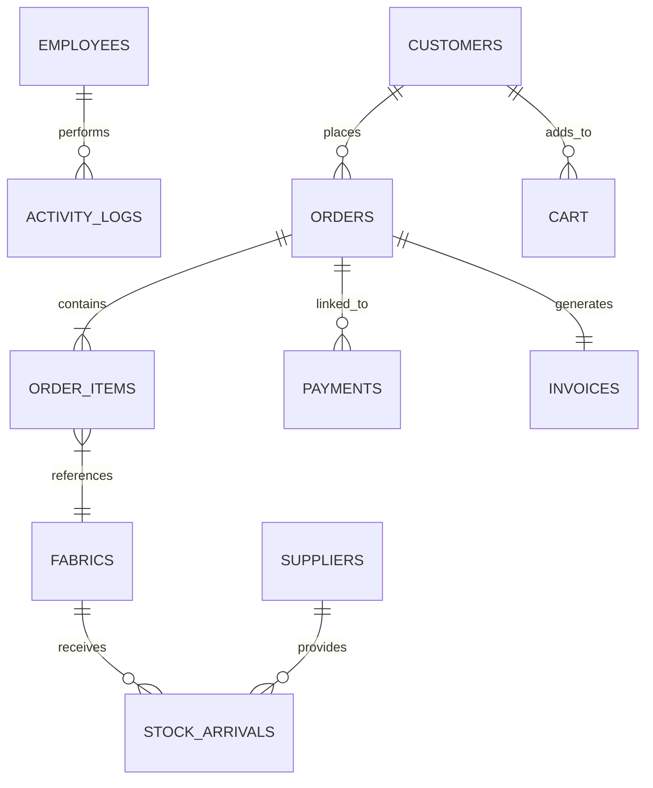

# System Specifications - Fabric Management System

This document provides a comprehensive breakdown of the database architecture, including Table Specifications and Record Specifications for the Fabric Management System.

## 1. System Enums & Types
The system uses custom PostgreSQL types to enforce data integrity across various modules.

| Type Name | Values | Description |
| :--- | :--- | :--- |
| `user_role` | `ADMIN`, `INVENTORY_MANAGER`, `SALESPERSON` | Defines access levels for staff. |
| `user_status` | `ACTIVE`, `INACTIVE` | Current employment status. |
| `order_status` | `PENDING`, `PROCESSING`, `SHIPPED`, `DELIVERED`, `CANCELLED` | Lifecycle of a customer order. |
| `payment_status` | `PENDING`, `COMPLETED`, `FAILED`, `REFUNDED` | Status of financial transactions. |

---

## 2. Table Specifications

### 2.1 User & Staff Management

#### Table: `employees`
Stores authentication and profile data for internal staff members.

| Column | Type | Constraints | Description |
| :--- | :--- | :--- | :--- |
| `employee_id` | SERIAL | PRIMARY KEY | Unique ID |
| `full_name` | VARCHAR(255) | NOT NULL | Staff name |
| `email` | VARCHAR(255) | NOT NULL, UNIQUE | Login email |
| `password` | VARCHAR(255) | NOT NULL | BCrypt hashed password |
| `nic` | VARCHAR(50) | NOT NULL, UNIQUE | National ID |
| `telephone` | VARCHAR(20) | | Contact number |
| `role` | `user_role` | NOT NULL | System permissions |
| `status` | `user_status` | DEFAULT 'ACTIVE' | Active/Inactive flag |
| `created_at` | TIMESTAMP | DEFAULT NOW() | Record creation date |

#### Table: `customers`
Stores profile and login data for external customers.

| Column | Type | Constraints | Description |
| :--- | :--- | :--- | :--- |
| `customer_id` | SERIAL | PRIMARY KEY | Unique ID |
| `full_name` | VARCHAR(255) | NOT NULL | Customer name |
| `email` | VARCHAR(100) | NOT NULL, UNIQUE | Login email |
| `password` | VARCHAR(100) | NOT NULL | Password |
| `tel` | VARCHAR(10) | NOT NULL | Contact number |
| `address` | VARCHAR(255) | NOT NULL | Shipping address |

---

### 2.2 Inventory Management

#### Table: `fabrics`
The core catalog of fabric products.

| Column | Type | Constraints | Description |
| :--- | :--- | :--- | :--- |
| `fabric_id` | SERIAL | PRIMARY KEY | Unique ID |
| `name` | VARCHAR(255) | NOT NULL | Fabric identifier |
| `material_type` | VARCHAR(100) | | e.g., Cotton, Silk, Linen |
| `color` | VARCHAR(50) | | Color identifier/Hex |
| `design` | VARCHAR(100) | | Pattern name/code |
| `price_per_meter` | NUMERIC | > 0 | Unit price |
| `stock_quantity` | INTEGER | DEFAULT 0 | Total meters in stock |
| `stock_available_quantity`| NUMERIC | >= 0 | Multi-variant quantity |
| `is_in_catalog` | BOOLEAN | DEFAULT TRUE | Visibility in public shop |
| `restock_level` | INTEGER | DEFAULT 100 | Threshold for alerts |
| `restock_date` | DATE | | Last/Next arrival date |
| `image_url` | TEXT | | Product image path |
| `width` | VARCHAR(50) | | e.g., 45", 60" |

#### Table: `suppliers`
Details of fabric manufacturers/distributors.

| Column | Type | Constraints | Description |
| :--- | :--- | :--- | :--- |
| `supplier_id` | SERIAL | PRIMARY KEY | Unique ID |
| `name` | VARCHAR(255) | NOT NULL | Company name |
| `contact_person`| VARCHAR(255) | | Primary contact name |
| `contact_number`| VARCHAR(20) | | Primary contact phone |
| `email` | VARCHAR(255) | | Official email |
| `address` | TEXT | | Business address |

---

### 2.3 Sales & Orders

#### Table: `orders`
Header table for customer purchases.

| Column | Type | Constraints | Description |
| :--- | :--- | :--- | :--- |
| `order_id` | SERIAL | PRIMARY KEY | Unique ID |
| `customer_id` | INTEGER | REFERENCES `customers` | Foreign Key |
| `customer_name` | VARCHAR(255) | | Snapshot at time of order |
| `phone_number` | VARCHAR(20) | | Snapshot for delivery |
| `delivery_address`| TEXT | | Snapshot for delivery |
| `delivery_type` | VARCHAR(100) | | Courier/Self-pickup |
| `total_amount` | NUMERIC | NOT NULL | Total cost |
| `order_status` | `order_status` | DEFAULT 'PENDING' | Logical flow |
| `order_date` | TIMESTAMP | DEFAULT NOW() | Checkout time |

#### Table: `order_items`
Snapshot of items within a specific order.

| Column | Type | Constraints | Description |
| :--- | :--- | :--- | :--- |
| `order_item_id` | SERIAL | PRIMARY KEY | Unique ID |
| `order_id` | INTEGER | REFERENCES `orders` | Foreign Key |
| `fabric_id` | INTEGER | REFERENCES `fabrics` | Foreign Key |
| `quantity` | NUMERIC | > 0 | Meters ordered |
| `unit_price` | NUMERIC | NOT NULL | Price at time of order |

---

### 2.4 Finance & Operations

#### Table: `payments`
Tracks financial transactions linked to orders.

| Column | Type | Constraints | Description |
| :--- | :--- | :--- | :--- |
| `payment_id` | SERIAL | PRIMARY KEY | Unique ID |
| `order_id` | INTEGER | REFERENCES `orders` | Foreign Key |
| `amount` | NUMERIC | NOT NULL | Value paid |
| `payment_method`| VARCHAR(50) | | Cash, Card, Bank Slip |
| `payment_status`| `payment_status`| DEFAULT 'PENDING' | Verification status |
| `bank_slip_url` | TEXT | | Image path if applicable |

#### Table: `stock_arrivals`
Ledger of incoming inventory from suppliers.

| Column | Type | Constraints | Description |
| :--- | :--- | :--- | :--- |
| `arrival_id` | SERIAL | PRIMARY KEY | Unique ID |
| `fabric_id` | INTEGER | REFERENCES `fabrics` | Foreign Key |
| `supplier_id` | INTEGER | REFERENCES `suppliers` | Foreign Key |
| `quantity` | NUMERIC | NOT NULL | Meters received |
| `total_value` | NUMERIC | NOT NULL | Purchase cost |

---

## 3. Record Specifications

### 3.1 Data Record Structure
Every record in the system follows a JSON-like structure when transmitted via the API. Below are examples of primary objects:

#### Fabric Record Structure
```json
{
  "fabric_id": 42,
  "name": "Emerald Silk",
  "material_type": "Silk",
  "price_per_meter": 2500.00,
  "stock_quantity": 150,
  "is_in_catalog": true,
  "status": "OK"
}
```

#### Order Record Structure
```json
{
  "order_id": 1001,
  "customer_id": 5,
  "total_amount": 7500.00,
  "order_status": "PENDING",
  "items": [
    { "name": "Emerald Silk", "quantity": 3, "unit_price": 2500.00 }
  ]
}
```

---

## 4. Entity Relationship Diagram (ERD)



---

## 5. Metadata & Logs
- **`activity_logs`**: Tracks IP addresses and User Agents for all security-sensitive actions.
- **`confirmation_logs`**: Tracks SMS/Email notifications sent to customers.
- **`password_resets`**: Secure storage for temporary OTP tokens.
