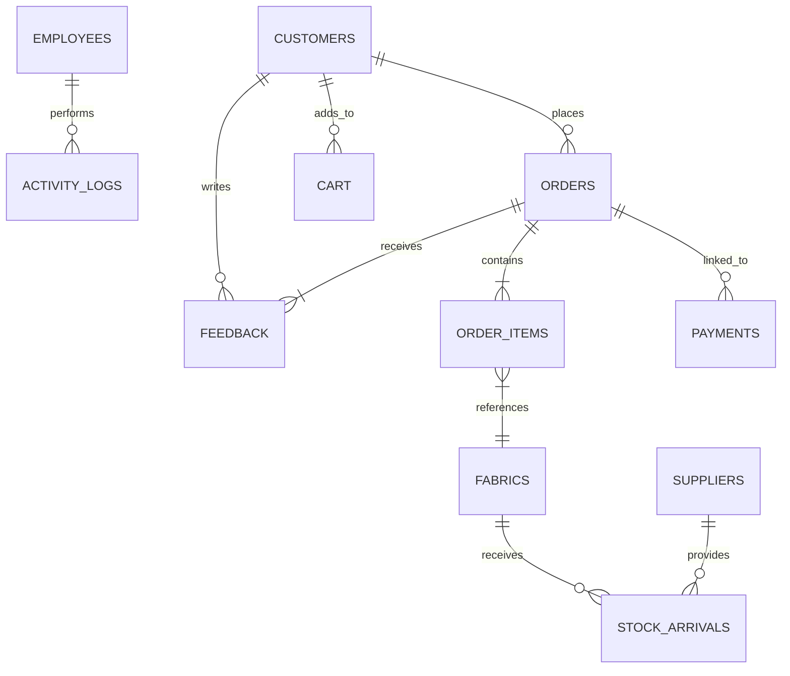

# System Specifications - Fabric Management System

This document provides a comprehensive breakdown of the database architecture, including Table Specifications and Record Specifications for the Fabric Management System.

## 1. System Enums & Types
The system uses constraints and type checks to enforce data integrity.

| Field Name | Values | Description |
| :--- | :--- | :--- |
| `role` | `ADMIN`, `INVENTORY`, `SALES` | Defines access levels for staff. |
| `status` | `ACTIVE`, `INACTIVE` | Current employment status. |
| `order_status` | `PENDING`, `PROCESSING`, `DELIVERED`, `CANCELLED` | Lifecycle of a customer order. |
| `payment_status` | `PENDING`, `COMPLETED`, `FAILED` | Status of financial transactions. |
| `order_source` | `ONLINE`, `IN_STORE` | Origin of the customer order. |

---

## 2. Table Specifications

### 2.1 User & Staff Management

#### Table: `employees`
Stores authentication and profile data for internal staff members.

| Column | Type | Constraints | Description |
| :--- | :--- | :--- | :--- |
| `employee_id` | SERIAL | PRIMARY KEY | Unique ID |
| `full_name` | VARCHAR(255) | NOT NULL | Staff name |
| `email` | VARCHAR(255) | NOT NULL, UNIQUE | Login email |
| `password` | VARCHAR(255) | NOT NULL | BCrypt hashed password |
| `nic` | VARCHAR(50) | NOT NULL, UNIQUE | National ID |
| `telephone` | VARCHAR(20) | | Contact number |
| `role` | VARCHAR(20) | NOT NULL | System permissions |
| `status` | VARCHAR(20) | DEFAULT 'ACTIVE' | Active/Inactive flag |
| `created_at` | TIMESTAMP | DEFAULT CURRENT_TIMESTAMP | Record creation date |

#### Table: `customers`
Stores profile and login data for external customers.

| Column | Type | Constraints | Description |
| :--- | :--- | :--- | :--- |
| `customer_id` | SERIAL | PRIMARY KEY | Unique ID |
| `full_name` | VARCHAR(255) | NOT NULL | Customer name |
| `email` | VARCHAR(255) | NOT NULL, UNIQUE | Login email |
| `password` | VARCHAR(255) | NOT NULL | Password |
| `tel` | VARCHAR(20) | | Contact number |
| `address` | TEXT | NOT NULL | Shipping address |
| `created_at` | TIMESTAMP | DEFAULT CURRENT_TIMESTAMP | Record creation date |

---

### 2.2 Inventory Management

#### Table: `fabrics`
The core catalog of fabric products.

| Column | Type | Constraints | Description |
| :--- | :--- | :--- | :--- |
| `fabric_id` | SERIAL | PRIMARY KEY | Unique ID |
| `name` | VARCHAR(255) | NOT NULL | Fabric identifier |
| `material_type` | VARCHAR(100) | | e.g., Cotton, Silk |
| `color` | VARCHAR(50) | | Color identifier |
| `design` | VARCHAR(100) | | Pattern name/code |
| `price_per_meter` | DECIMAL(10, 2) | NOT NULL | Unit price |
| `stock_quantity` | DECIMAL(10, 2) | DEFAULT 0 | Total meters in stock |
| `stock_available_quantity`| DECIMAL(10, 2) | DEFAULT 0 | Safe margin quantity |
| `reorder_level` | DECIMAL(10, 2) | DEFAULT 50 | Threshold for alerts |
| `image_url` | TEXT | | Product image path |
| `width` | VARCHAR(50) | | e.g., 45", 60" |
| `restock_date` | DATE | | Last/Next arrival date |
| `is_in_catalog` | BOOLEAN | DEFAULT TRUE | Visibility in shop |

#### Table: `suppliers`
Details of fabric manufacturers/distributors.

| Column | Type | Constraints | Description |
| :--- | :--- | :--- | :--- |
| `supplier_id` | SERIAL | PRIMARY KEY | Unique ID |
| `name` | VARCHAR(255) | NOT NULL | Company name |
| `contact_person`| VARCHAR(255) | | Primary contact |
| `contact_number`| VARCHAR(20) | | Phone |
| `email` | VARCHAR(255) | | Official email |
| `address` | TEXT | | Business address |

---

### 2.3 Sales & Orders

#### Table: `orders`
Header table for customer purchases.

| Column | Type | Constraints | Description |
| :--- | :--- | :--- | :--- |
| `order_id` | SERIAL | PRIMARY KEY | Unique ID |
| `customer_id` | INTEGER | REFERENCES `customers` | Foreign Key |
| `order_status` | VARCHAR(20) | DEFAULT 'PENDING' | Logical flow |
| `total_amount` | DECIMAL(12, 2) | NOT NULL | Total cost |
| `delivery_address`| TEXT | | Delivery snapshot |
| `delivery_type` | VARCHAR(50) | DEFAULT 'STANDARD'| Courier/Pickup |
| `customer_name` | VARCHAR(255) | | Snapshot |
| `phone_number` | VARCHAR(20) | | Snapshot |
| `verified_at` | TIMESTAMP | | Sales verification |
| `delivered_by` | VARCHAR(255) | | Delivery agent |
| `tracking_id` | VARCHAR(100) | | Courier tracking |
| `order_source` | VARCHAR(20) | DEFAULT 'ONLINE' | Online / In-Store |

#### Table: `order_items`
Snapshot of items within a specific order.

| Column | Type | Constraints | Description |
| :--- | :--- | :--- | :--- |
| `order_item_id` | SERIAL | PRIMARY KEY | Unique ID |
| `order_id` | INTEGER | REFERENCES `orders` | Foreign Key |
| `fabric_id` | INTEGER | REFERENCES `fabrics` | Foreign Key |
| `quantity` | DECIMAL(10, 2) | NOT NULL | Meters ordered |
| `unit_price` | DECIMAL(10, 2) | NOT NULL | Snapshot price |
| `total_price` | DECIMAL(12, 2) | NOT NULL | Item total |

---

### 2.4 Finance & Operations

#### Table: `payments`
Tracks financial transactions linked to orders.

| Column | Type | Constraints | Description |
| :--- | :--- | :--- | :--- |
| `payment_id` | SERIAL | PRIMARY KEY | Unique ID |
| `order_id` | INTEGER | REFERENCES `orders` | Foreign Key |
| `amount` | DECIMAL(12, 2) | NOT NULL | Value paid |
| `payment_method`| VARCHAR(50) | | Cash, Card, Bank Slip |
| `payment_status`| VARCHAR(20) | DEFAULT 'PENDING' | Status Verification |
| `bank_slip_url` | TEXT | | Image path |

#### Table: `stock_arrivals`
Ledger of incoming inventory from suppliers.

| Column | Type | Constraints | Description |
| :--- | :--- | :--- | :--- |
| `arrival_id` | SERIAL | PRIMARY KEY | Unique ID |
| `fabric_id` | INTEGER | REFERENCES `fabrics` | Foreign Key |
| `supplier_id` | INTEGER | REFERENCES `suppliers` | Foreign Key |
| `quantity` | DECIMAL(10, 2) | NOT NULL | Meters received |
| `total_value` | DECIMAL(12, 2) | NOT NULL | Purchase cost |

---

### 2.5 Supporting Tables
- **`cart`**: Current active shopping carts for customers.
- **`feedback`**: Order reviews and ratings from customers.
- **`confirmation_logs`**: SMS/Email logs sent to customers.
- **`activity_logs`**: Tracks employee actions for transparency.
- **`password_resets`**: Secure temporary OTP tokens for account recovery.

---

## 3. Entity Relationship Diagram (ERD)

